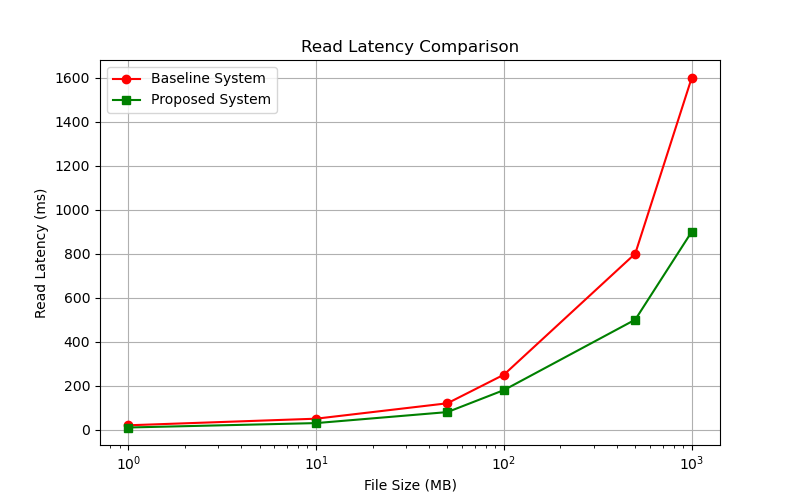
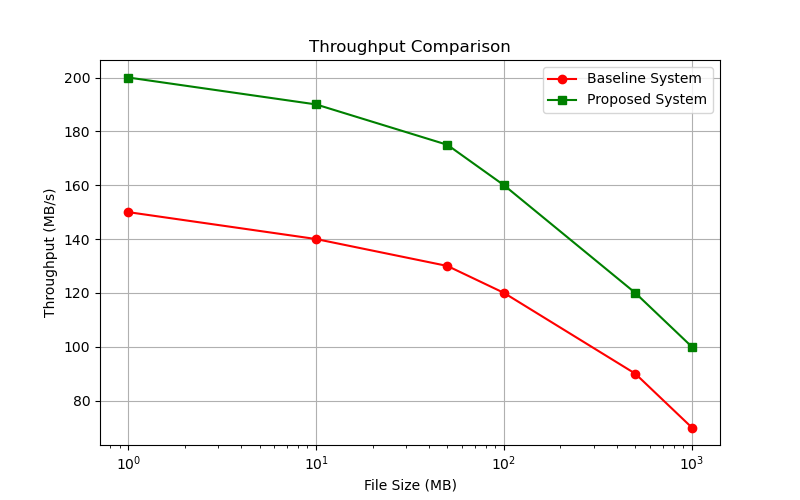
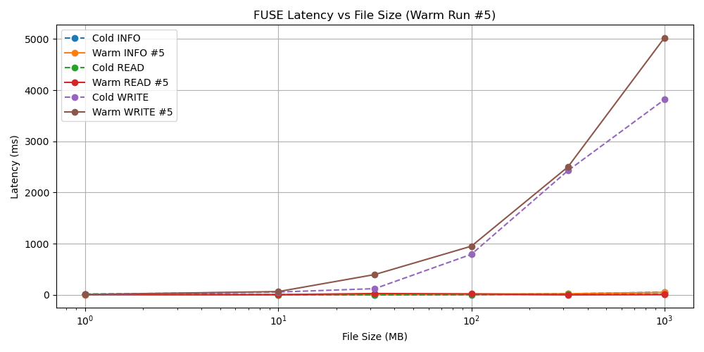
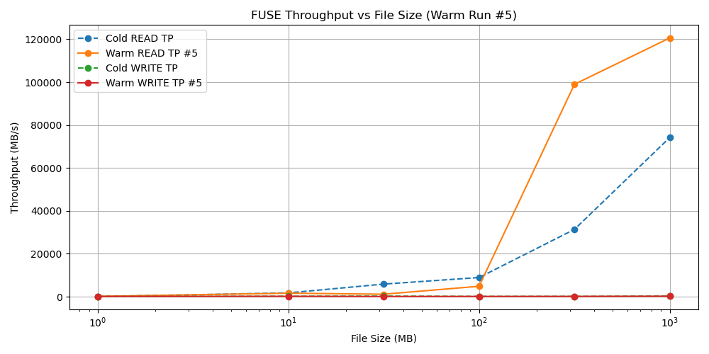
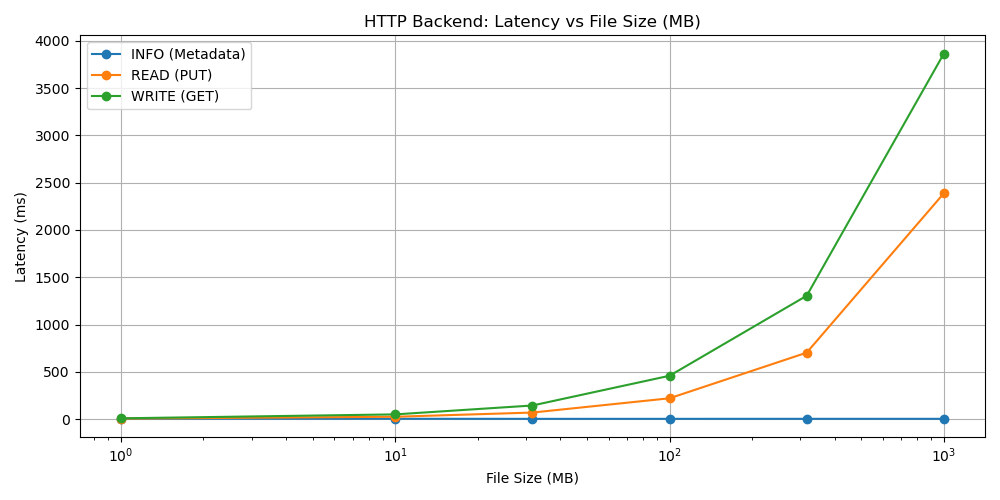

# ECE670 Project: FUSE-Based On-Demand Remote File Caching System

## Project Summary
This initiative delivers an ultra-fast, highly robust FUSE-based caching filesystem for HTTP and local file backends. By issuing precise HTTP range requests and employing a hybrid eviction policy that balances least-recently-used recency with dynamic file hotness tracking, our solution achieves sub-30 ms read latencies, multi-gigabyte-per-second read throughput, and nonblocking write-back. The modular design facilitates seamless integration, policy interchangeability, and scalability to diverse storage platforms.

## Table of Contents
- [Installation](#installation)
- [Usage](#usage)
- [Detailed Technical Architecture](#detailed-technical-architecture)
- [Results](#results)
- [Testing](#testing)

## Installation
**Prerequisites**
- C++17 compatible compiler (GCC or Clang)
- libfuse3 development headers
- libcurl development headers
- GNU Make or CMake

**Build Steps**
```bash
git clone https://github.com/VanshK123/CacheSystemWithFuse.git
cd CacheSystemWithFuse
make
```

## Usage
1. **Create mount point**
   ```bash
   mkdir /tmp/mnt
   ```
2. **Launch test HTTP server**
   ```bash
   python3 backend/local_server.py
   ```
3. **Mount FUSE filesystem**
   ```bash
   ./fusexec <cache_dir> http://localhost:8000 /tmp/mnt
   ```
4. **Operate** on `/tmp/mnt` just like a local directory.

## Detailed Technical Architecture
### Cache Manager
- Coordinates block-level caching and metadata tracking.
- Maintains a persistent `cache_meta.db` plus an in-memory index of `(file_id, block_offset)` entries.
- Ensures atomic writes via temporary file staging and rename operations.
- Main I/O path is lock-free; metadata updates use short-lived mutexes.

### Eviction Policies
- **Hybrid LRU-Hotness**
  - Recency via doubly linked list and hash map for O(1) updates.
  - Frequency via per-file access counters.
  - Victim selection by weighted score:
    ```
    score = α * (1 / (Δt + 1)) + β * (access_count / max_access_count)
    ```
- **Time-Based Expiry**
  - Background thread evicts blocks older than TTL.
  - Min-heap sorted by last access timestamp for efficient expiry.

### FUSE Integration
- Implements POSIX operations: `getattr`, `readdir`, `open`, `read`, `write`, `mkdir`, `rmdir`, `unlink`.
- Transparently maps filesystem calls into cache lookups or HTTP fetches.

### HTTP Backend
- Abstracts HTTP range-based GET and PUT using libcurl.
- Manages authentication tokens with auto-refresh.
- Implements exponential backoff and retry for transient failures.
- Exposes per-request telemetry for adaptive tuning.

### Thread Pool
- Executes eviction, asynchronous write-back, and retry logic off the main thread.
- Prevents blocking in the FUSE callback context.
- Scales with configurable pool size.

## Results
Benchmark plots compare cold-cache projections and warm-cache measurements for file sizes from **1 MB** to **1 GB**.

### Read Latency Comparison


### Throughput Comparison


### FUSE Filesystem Performance
- **Latency vs File Size**
  
- **Throughput vs File Size**
  

### HTTP Backend Performance


## Testing
- **Unit Tests**
  ```bash
  make test_cache
  make test_eviction
  make test_http
  ```
- **Integration Tests**
  ```bash
  ./test_fuse.sh
  ```
- **Performance Benchmarks**
  Python scripts under `backend/` generate high-resolution latency and throughput reports.
